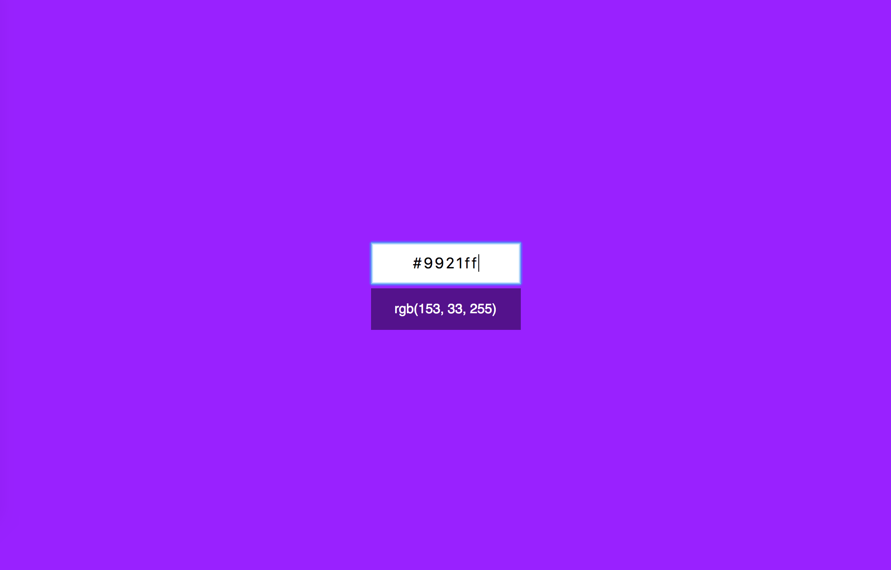

GH pages: https://ajoq.github.io/ra-hex-rgb-converter/

# Конвертер цветов из HEX в RGB на React

## Интерфейс конвертера

При правильном вводе цвета он показывает его представление в формате RGB и меняет цвет фона на заданный:

Конвертер при вводе неправильного цвета в формате HEX должен сообщать об ошибке:

